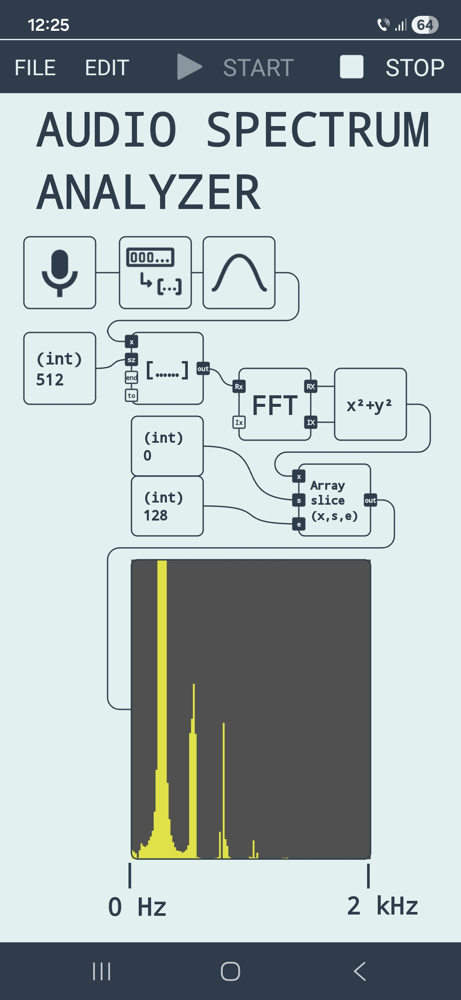

# Audio Spectrum Analyzer (made in IoToToy)

A real-time audio spectrum analyzer built using the [IoToToy](https://play.google.com/store/apps/details?id=com.hardcodedjoy.iototoy&referrer=utm_source%3Dgh) visual programming app for Android.

## Overview

This project visualizes audio frequencies captured from the device microphone. It processes the signal through a Hann window and a Fast Fourier Transform (FFT) to display a frequency distribution from 0 Hz to 2 kHz.

## Signal Chain

The logic is defined in `audio spectrum analyzer.json` and follows this flow:

1.  **Microphone**: Configured to capture mono audio at 8000 Hz.
2.  **Hann Window**: Smooths the input signal to improve FFT accuracy.
3.  **Buffer**: Groups data into blocks of 512 samples.
4.  **FFT**: Converts audio from the Time Domain to the Frequency Domain.
5.  **Square Sum**: Calculates the power / magnitude of the frequencies.
6.  **Array Slice**: Extracts the 0 - 2000 Hz range for visualization.
7.  **Progress Bar**: Renders the spectrum visually on the screen.

## How to Use

1.  Install **IoToToy** on your Android device.
2.  Download the `audio spectrum analyzer.json` file from this repository.
3.  Open IoToToy then **FILE -> OPEN** the JSON file.
4.  Run the diagram to see the real-time spectrum of your environment.

## Requirements

*   Android device with microphone access.
*   [IoToToy app](https://play.google.com/store/apps/details?id=com.hardcodedjoy.iototoy&referrer=utm_source%3Dgh) (v1.0.5 or newer).
